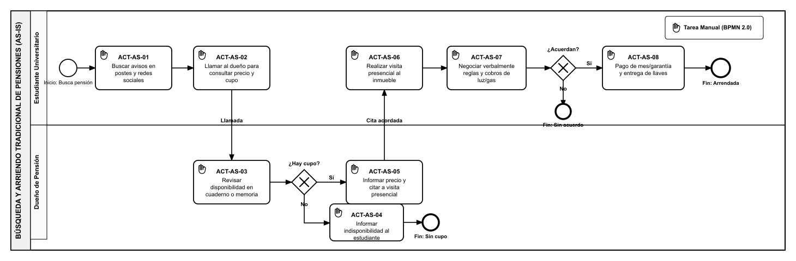

# Proceso de negocio — AS-IS

## Macro-proceso y proceso específico

**Gestión de Alojamiento Estudiantil y Bienestar Universitario** → *Búsqueda, Consulta de Disponibilidad y Arriendo Tradicional de Habitaciones en Pensiones Universitarias*.

## Objetivo de negocio del proceso

Permitir que los estudiantes de educación superior encuentren y arrienden una habitación habitacional adecuada y accesible para su periodo académico, asegurando a los propietarios de pensiones la ocupación de sus habitaciones disponibles y la percepción de ingresos mediante acuerdos informales o directos.

## Participantes y sus objetivos

| Participante | Objetivo en el proceso |
|--------------|------------------------|
| **Estudiante Universitario** | Encontrar y asegurar una habitación dentro de su presupuesto, ubicada a una distancia razonable de su casa de estudios, con servicios básicos funcionales y reglas de convivencia claras, minimizando el tiempo y riesgo de estafa en la búsqueda. |
| **Dueño de Pensión** | Mantener sus habitaciones arrendadas de forma continua a estudiantes confiables, evitar vacancias desocupadas y percibir el canon de arriendo mensual con el menor esfuerzo operativo y administrativo posible. |

## Diagrama AS-IS

Archivo fuente: [`./assets/diagramas/as-is.bpmn`](./assets/diagramas/as-is.bpmn)

> **Nota de notación BPMN 2.0:** Todas las tareas del proceso AS-IS corresponden a **Tareas Manuales** (identificadas con el ícono de mano en la esquina superior izquierda de cada actividad), dado que el proceso actual carece de soporte de un software dedicado y se ejecuta exclusivamente mediante interacciones humanas presenciales, cuadernos físicos o llamadas telefónicas.

---

## Actividades del Proceso AS-IS

### ACT-AS-01 — Buscar avisos informales en postes y redes sociales
El estudiante recorre a pie los alrededores de las sedes universitarias buscando carteles pegados en postes, murales de facultades o avisos dispersos en grupos informales de Facebook/Instagram, recopilando números de contacto sin información verificada.

### ACT-AS-02 — Llamar al dueño para consultar precio y cupo
El estudiante realiza llamadas telefónicas reiteradas a los números anotados para preguntar si la pensión aún dispone de piezas libres, cuál es el valor mensual exacto y qué condiciones solicitan.

### ACT-AS-03 — Revisar disponibilidad en cuaderno o memoria
Al recibir la llamada, el propietario interrumpe sus labores cotidianas para consultar su cuaderno de anotaciones o memoria y verificar si alguna de las piezas se encuentra libre o reservada para el semestre.

### ACT-AS-04 — Informar indisponibilidad al estudiante
En caso de no haber cupos libres, el dueño notifica verbalmente al estudiante, dando término al intento de arriendo sin alternativas ni registro histórico.

### ACT-AS-05 — Informar precio y citar a visita presencial
Si cuenta con cupo, el dueño indica verbalmente el precio base y fija una cita en el inmueble para mostrar la habitación.

### ACT-AS-06 — Realizar visita presencial al inmueble
El estudiante se traslada físicamente a la dirección de la pensión para conocer la habitación, la fachada y el estado general de la vivienda.

### ACT-AS-07 — Negociar verbalmente reglas y cobros de luz/gas
Durante la visita, el estudiante y el dueño dialogan sobre las normas de la casa (toque de queda, visitas, uso de lavadora) y si los cobros de electricidad, agua, gas y WiFi están o no incluidos en la mensualidad.

### ACT-AS-08 — Pago de mes/garantía y entrega de llaves
Habiendo acuerdo mutuo, el estudiante entrega el dinero en efectivo o realiza una transferencia electrónica por el primer mes y mes de garantía, y el dueño hace entrega manual de las llaves de la habitación.

---

## Problemas identificados

- **P1 (Estudiante): Alta fricción y pérdida de tiempo en llamadas ciegas:** El estudiante gasta días llamando a números telefónicos desactualizados o arrancados de postes, descubriendo reiteradamente que la habitación ya fue arrendada hace semanas.
- **P2 (Estudiante): Asimetría de información y cobros imprevistos:** Los acuerdos verbales provocan sorpresas posteriores al arriendo, tales como cobros adicionales por uso de estufas/ducha, cortes imprevistos de gas o normas estrictas no comunicadas al inicio (ej. prohibición total de visitas para estudiar o toques de queda nocturnos).
- **P3 (Estudiante): Incertidumbre en la calidad de los servicios esenciales:** El estudiante no tiene cómo auditar previamente si la conexión a internet es suficiente para rendir evaluaciones académicas o si el ambiente es propicio para el descanso y estudio.
- **P4 (Dueño): Sobrecarga y descontrol en la gestión de disponibilidad:** El dueño sufre interrupciones constantes por llamadas a deshoras para consultar por piezas ya ocupadas, debiendo gestionar su inventario en libretas manuales con riesgo de comprometer la misma pieza a dos personas.
- **P5 (Dueño): Dependencia de carteles físicos y canales no segmentados:** Dificultad para llegar rápidamente a estudiantes de universidades específicas cuando una habitación se desocupa a mitad de semestre.
