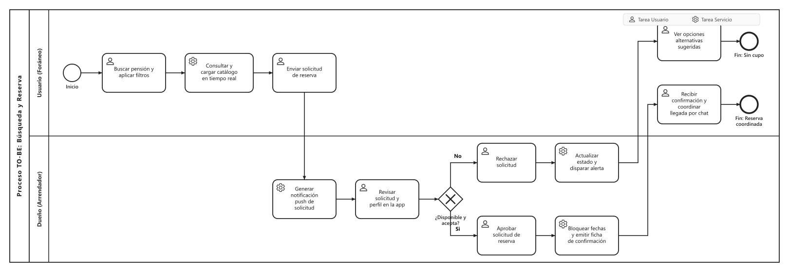

# Análisis de rediseño y propuesta TO-BE

## Mejoras identificadas por participante

| Participante | Objetivo | Problema | Mejora deseada |
|--------------|----------|----------|-----------------|
| **Usuario (Foráneo / Estudiante)** | Encontrar y asegurar alojamiento universitario con filtros precisos y confirmación formal. | Pérdida de tiempo llamando a avisos obsoletos, llamadas infructuosas y falta de alternativas si la pensión está ocupada. | Filtrar catálogo georreferenciado en tiempo real, enviar solicitud formal de reserva, recibir alternativas inteligentes si se rechaza, y coordinar llegada por chat integrado. |
| **Dueño (Arrendador)** | Administrar eficientemente las postulaciones y mantener habitaciones ocupadas sin saturación telefónica. | Sobrecarga de llamadas a deshoras, libretas manuales de disponibilidad y descontrol en la recepción de interesados. | Recibir solicitudes estructuradas con notificación push móvil, evaluar perfil del postulante con un toque (aprobar/rechazar) y bloquear fechas automáticamente. |

---

## Iniciativas de rediseño

### Iniciativa 1 — Búsqueda con Filtros Multicriterio y Catálogo en Tiempo Real
- **Actividad(es) del AS-IS que afecta:** [`ACT-AS-01`](./01-proceso-as-is.md#act-as-01) y [`ACT-AS-02`](./01-proceso-as-is.md#act-as-02) (Estudiante).
- **Heurística aplicada:** **Empoderamiento (Autoservicio)** + **Tecnología Integral** *(Reijers & Liman Mansar, 2005)*.
- **Objetivo o mejora que resuelve:** El estudiante foráneo filtra de forma autónoma por sede universitaria, precio y normas de convivencia, cargando ofertas con disponibilidad confirmada en tiempo real.
- **Efecto esperado (tiempo/costo/calidad/flexibilidad):** Reduce el tiempo de búsqueda de días a minutos; suprime llamadas telefónicas ciegas y maximiza la calidad y exactitud de los datos visualizados.

### Iniciativa 2 — Solicitud Digital de Reserva y Gestión Móvil con Notificaciones Push
- **Actividad(es) del AS-IS que afecta:** [`ACT-AS-02`](./01-proceso-as-is.md#act-as-02) y [`ACT-AS-03`](./01-proceso-as-is.md#act-as-03) (Dueño / Estudiante).
- **Heurística aplicada:** **Automatización de tareas** + **Adición de control** *(Reijers & Liman Mansar, 2005)*.
- **Objetivo o mejora que resuelve:** El estudiante envía una solicitud digital de reserva estructurada; el sistema despacha de inmediato una notificación push al celular del arrendador, quien evalúa el perfil del estudiante y decide con un solo toque.
- **Efecto esperado (tiempo/costo/calidad/flexibilidad):** Elimina interrupciones por llamadas telefónicas imprevistas; agiliza la toma de decisiones y erradica el uso de cuadernos de notas físicos.

### Iniciativa 3 — Bloqueo Automatizado, Sugerencia de Alternativas y Coordinación por Chat
- **Actividad(es) del AS-IS que afecta:** [`ACT-AS-04`](./01-proceso-as-is.md#act-as-04) y [`ACT-AS-05`](./01-proceso-as-is.md#act-as-05).
- **Heurística aplicada:** **Integración de casos** + **Contacto directo al cliente** *(Reijers & Liman Mansar, 2005)*.
- **Objetivo o mejora que resuelve:** En caso de rechazo, el sistema alerta al postulante y sugiere automáticamente pensiones similares disponibles (evitando que el estudiante quede sin opciones). En caso de aprobación, el sistema bloquea fechas, emite comprobante oficial en PDF y habilita chat directo para coordinar la llegada.
- **Efecto esperado (tiempo/costo/calidad/flexibilidad):** Brinda certidumbre total a ambas partes; garantiza respaldo formal y reduce drásticamente la tasa de abandono de búsqueda.

---

## Diagrama TO-BE

Archivo fuente: [`./assets/diagramas/to-be.bpmn`](./assets/diagramas/to-be.bpmn)

> **Nota de notación BPMN 2.0:** El diagrama distingue explícitamente los tipos de tareas según la norma oficial:
> - **Tareas de Usuario (`User Task`):** Marcadas con ícono de silueta de persona (ejecutadas por el usuario o dueño con apoyo de la interfaz gráfica).
> - **Tareas de Servicio (`Service Task`):** Marcadas con ícono de engranaje (ejecutadas automáticamente por los servicios backend de la plataforma).
> - **Compuerta Exclusiva (`Exclusive Gateway`):** Rombo con marcador 'X' que evalúa la decisión de disponibilidad y aceptación del arrendador.

---

## Actividades del Proceso TO-BE

### Carril: Usuario (Foráneo)
- **ACT-TOBE-01 — Buscar pensión y aplicar filtros:** Tarea de Usuario (`User Task`). El estudiante ingresa a la aplicación y aplica filtros por campus universitario, rango de precio y normas de convivencia.
- **ACT-TOBE-02 — Consultar y cargar catálogo en tiempo real:** Tarea de Servicio (`Service Task`). El backend consulta la base de datos y despliega en tiempo real las piezas disponibles que cumplen los criterios.
- **ACT-TOBE-03 — Enviar solicitud de reserva:** Tarea de Usuario (`User Task`). El estudiante selecciona la habitación deseada, define fechas estimadas de llegada y envía la solicitud formal con su mensaje.

### Carril: Dueño (Arrendador)
- **ACT-TOBE-04 — Generar notificación push de solicitud:** Tarea de Servicio (`Service Task`). El sistema despacha una notificación push inmediata al smartphone del arrendador avisando de la nueva postulación.
- **ACT-TOBE-05 — Revisar solicitud y perfil en la app:** Tarea de Usuario (`User Task`). El arrendador abre la notificación, examina las fechas solicitadas y revisa el perfil universitario del estudiante.
- **Compuerta Exclusiva — ¿Disponible y acepta?:**
  - **Rama No:**
    - **ACT-TOBE-06 — Rechazar solicitud:** Tarea de Usuario (`User Task`). El dueño presiona el botón de rechazo (por cupo lleno o incompatibilidad de fechas).
    - **ACT-TOBE-07 — Actualizar estado y disparar alerta:** Tarea de Servicio (`Service Task`). El backend registra el rechazo en la base de datos y envía alerta push al postulante.
    - *(Flujo retorna a Usuario)* **ACT-TOBE-08 — Ver opciones alternativas sugeridas:** Tarea de Usuario (`User Task`). La aplicación despliega al estudiante una lista curada de pensiones con vacantes similares en el mismo sector (**Fin: Sin cupo**).
  - **Rama Sí:**
    - **ACT-TOBE-09 — Aprobar solicitud de reserva:** Tarea de Usuario (`User Task`). El dueño confirma y aprueba la postulación en la aplicación móvil.
    - **ACT-TOBE-10 — Bloquear fechas y emitir ficha de confirmación:** Tarea de Servicio (`Service Task`). El sistema actualiza el estado de la habitación a ocupada, inhabilita nuevas solicitudes para ese cupo y genera la ficha oficial de reserva en PDF.
    - *(Flujo retorna a Usuario)* **ACT-TOBE-11 — Recibir confirmación y coordinar llegada por chat:** Tarea de Usuario (`User Task`). El estudiante recibe la confirmación con el comprobante y accede al chat integrado para coordinar la llegada con el arrendador (**Fin: Reserva coordinada**).

---

## Actividades que cambian del AS-IS al TO-BE

| Actividad en el AS-IS | Actividad en el TO-BE | Qué cambia |
|-------------------------|--------------------------|------------|
| [`ACT-AS-01`](./01-proceso-as-is.md#act-as-01) — Buscar avisos informales en postes y redes sociales | [`ACT-TOBE-01`](#act-tobe-01) y [`ACT-TOBE-02`](#act-tobe-02) — Buscar pensión, aplicar filtros y cargar catálogo | La búsqueda manual física se reemplaza por un catálogo georreferenciado con filtros multicriterio en tiempo real. |
| [`ACT-AS-02`](./01-proceso-as-is.md#act-as-02) — Llamar para consultar disponibilidad y precio | [`ACT-TOBE-03`](#act-tobe-03) y [`ACT-TOBE-04`](#act-tobe-04) — Enviar solicitud de reserva y generar notificación push | Las llamadas telefónicas a ciegas se sustituyen por una solicitud formal digital con notificación push al móvil del dueño. |
| [`ACT-AS-03`](./01-proceso-as-is.md#act-as-03) — Revisar disponibilidad en cuaderno manual | [`ACT-TOBE-05`](#act-tobe-05) — Revisar solicitud y perfil en la app | El control en libretas de papel se cambia por la revisión ágil del perfil y fechas del postulante en la app móvil. |
| [`ACT-AS-04`](./01-proceso-as-is.md#act-as-04) — Realizar visita presencial a ciegas y riesgo de descarte | [`ACT-TOBE-06`](#act-tobe-06), [`ACT-TOBE-07`](#act-tobe-07) y [`ACT-TOBE-08`](#act-tobe-08) — Rechazar solicitud, alertar y sugerir alternativas | Si no hay cupo o no se acepta la postulación, el sistema alerta al estudiante y recomienda automáticamente pensiones alternativas cercanas. |
| [`ACT-AS-05`](./01-proceso-as-is.md#act-as-05) — Pago de mes/garantía y entrega de llaves | [`ACT-TOBE-09`](#act-tobe-09), [`ACT-TOBE-10`](#act-tobe-10) y [`ACT-TOBE-11`](#act-tobe-11) — Aprobar solicitud, bloquear fechas y coordinar llegada | El acuerdo verbal e informal se formaliza con aprobación digital, bloqueo de calendario, ficha oficial descargable en PDF y chat de coordinación. |
