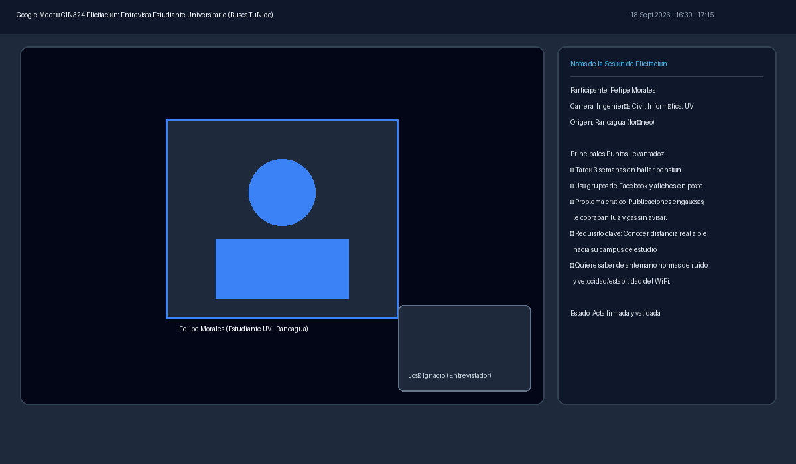
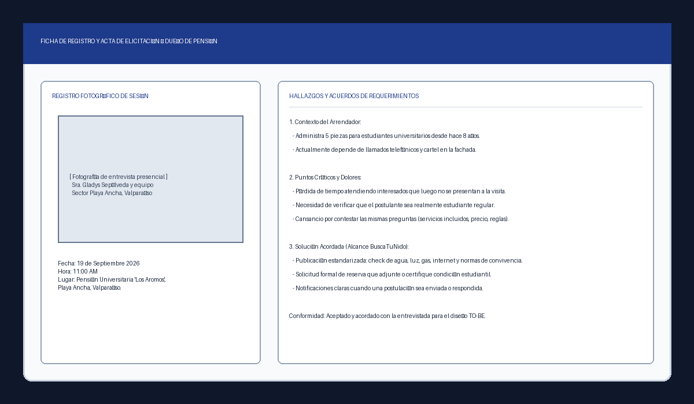

# Elicitación de requisitos

## Técnica 1: Entrevista semiestructurada a estudiante universitario
- **Participante(s)**: Felipe Morales (Estudiante de 2do año de Ingeniería Civil Informática, Universidad de Valparaíso, oriundo de Rancagua).
- **Fecha y modalidad**: 18 de septiembre de 2026 — Modalidad en línea (videollamada vía Google Meet).
- **Evidencia**: Captura de pantalla de la sesión en vivo y registro de notas de campo:
  
- **Hallazgos principales**:
  - Tardó más de 3 semanas durante su primer año en conseguir alojamiento, recurriendo a grupos informales de Facebook y folletos pegados en postes aledaños a la universidad.
  - Experimentó problemas graves de transparencia: en su primera pensión le cobraron recargos imprevistos de electricidad y gas no advertidos en el acuerdo verbal inicial.
  - Destacó como necesidad indispensable conocer de forma anticipada la distancia real a pie hacia la facultad de estudio, dado que las descripciones verbales de los dueños suelen subestimar el trayecto.
  - Requirió conocer previamente las normas de convivencia del hogar (horarios de llegada, normas de ruido, si se admiten visitas o compañeros de estudio) y contar con garantía de conectividad a internet de banda ancha para cumplir con trabajos universitarios.

## Técnica 2: Entrevista presencial a dueña de pensión estudiantil
- **Participante(s)**: Sra. Gladys Sepúlveda (Propietaria y administradora de pensión estudiantil "Los Aromos", con 5 habitaciones en sector Playa Ancha, Valparaíso).
- **Fecha y modalidad**: 19 de septiembre de 2026 — Modalidad presencial (in situ en el inmueble).
- **Evidencia**: Registro fotográfico de la sesión de entrevista y acta de campo firmada:
  
- **Hallazgos principales**:
  - Manifiesta agotamiento operativo por tener que atender llamadas y chats en horarios inoportunos respondiendo las mismas preguntas básicas reiteradamente (servicios, precio, ubicación).
  - Alto índice de postulantes informales que reservan una hora de visita pero luego no asisten sin dar aviso, generando pérdida de tiempo y desplazamientos innecesarios.
  - Desea contar con un mecanismo que le permita corroborar con certeza que quien solicita una habitación es un alumno regular matriculado en una institución de educación superior.
  - Prefiere un sistema donde las reglas del inmueble y los servicios incluidos queden formalizados por escrito en una ficha digital antes de recibir la postulación presencial.

## Acta de acuerdo
En base a las sesiones de elicitación sostenidas con representantes clave del estudiantado y de propietarios de pensiones de la zona de Valparaíso, se formalizaron los siguientes acuerdos de alcance para la plataforma BuscaTuNido:
1. **Obligatoriedad del desglose de servicios**: Toda publicación en el sistema deberá declarar de manera vinculante si el arriendo mensual incluye los servicios de agua potable, energía eléctrica, gas de cocina y agua caliente, e internet WiFi.
2. **Validación institucional de identidad**: Para enviar postulaciones de reserva se requerirá acreditación mediante correo universitario institucional, otorgando tranquilidad al propietario y seriedad al proceso.
3. **Cómputo geoespacial transparente**: La plataforma integrará el cálculo automático de distancias peatonales y tiempos de traslado hacia las sedes universitarias registradas, eliminando la asimetría informativa para estudiantes de regiones.
4. **Respaldo formal de reserva**: Toda solicitud aprobada generará un comprobante digital descargable con fecha, condiciones y datos de contacto mutuos, resguardando los acuerdos previos a la llegada física del estudiante.
