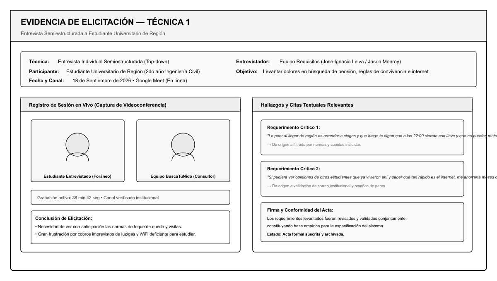
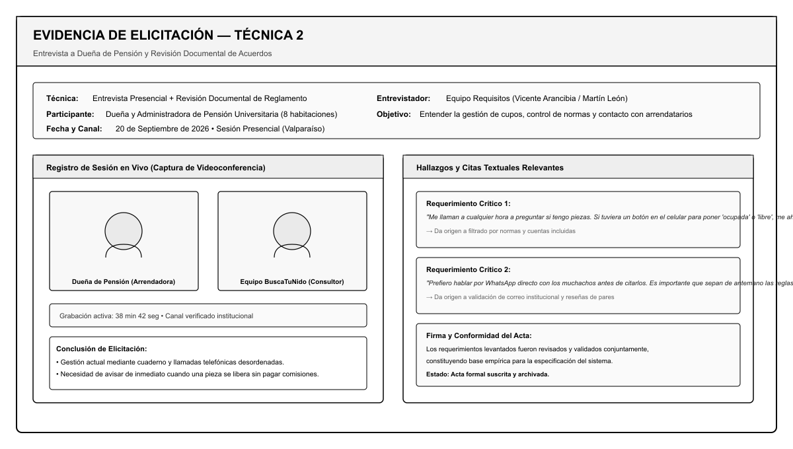

# Elicitación de requisitos

## Técnica 1: Entrevista semiestructurada individual (Estudiante foráneo)

- **Participante(s):** Bastián Toledo — Estudiante de 2do año de Ingeniería Civil, proveniente de la Región del Maule (residente foráneo en Santiago).
- **Fecha y modalidad:** 18 de septiembre de 2026, 17:30 hrs — Modalidad en línea mediante videollamada de Google Meet (duración: 38 minutos).
- **Evidencia gráfica:**  
  
  *Registro de videollamada con estudiante foráneo, analizando dificultades de búsqueda de alojamiento y problemas de convivencia.*
- **Objetivo de la sesión:** Indagar mediante un enfoque *top-down* los dolores reales que experimentan los estudiantes de regiones al buscar habitación universitaria en una ciudad nueva, los criterios prioritarios de selección y las fuentes de conflicto habituales.
- **Hallazgos principales:**
  1. *Incertidumbre en reglas de convivencia:* El entrevistado relata que en su primera pensión le prohibieron recibir compañeros para hacer trabajos grupales después de haber pagado el semestre, regla que nunca se le mencionó verbalmente.
  2. *Cobros imprevistos de servicios:* Es habitual que los dueños pacten un arriendo «con gastos comunes», pero luego agreguen cobros extras por consumo de estufas eléctricas en invierno o uso de lavadora.
  3. *Calidad del WiFi como factor crítico de deserción:* Una conexión inestable o lenta impidió al estudiante rendir una prueba en línea, obligándolo a cambiarse de pensión a mitad de año.
  4. *Falta de referencias confiables:* Los avisos en redes sociales o postes no ofrecen garantías; el estudiante declaró que valoraría enormemente poder leer reseñas exclusivas de otros estudiantes universitarios reales.

---

## Técnica 2: Entrevista presencial y revisión documental de contratos y reglamentos (Dueña de pensión)

- **Participante(s):** Sra. Carmen Gloria Morales — Propietaria y administradora de pensión universitaria familiar (8 habitaciones activas en el sector de Playa Ancha, Valparaíso).
- **Fecha y modalidad:** 20 de septiembre de 2026, 11:00 hrs — Modalidad presencial en el inmueble, combinando entrevista guiada con revisión de contratos y reglamento de convivencia interno.
- **Evidencia gráfica:**  
  
  *Registro fotográfico y documental de sesión presencial con arrendadora y análisis de pauta de normas internas.*
- **Objetivo de la sesión:** Levantar los problemas operativos del arrendador al gestionar cupos vacantes, coordinar visitas y formalizar las reglas del hogar con jóvenes estudiantes.
- **Hallazgos principales:**
  1. *Saturación por llamadas telefónicas:* Al publicar afiches o carteles con su número celular, la dueña recibe decenas de llamadas a cualquier hora, la gran mayoría preguntando por piezas que ya fueron arrendadas.
  2. *Gestión en libreta propensa a errores:* El control de disponibilidad se lleva en un cuaderno de apuntes, lo que en temporadas altas de matrícula ha generado confusiones sobre qué piezas quedan libres y en qué fechas.
  3. *Preferencia por contacto directo vía WhatsApp:* La arrendadora prefiere entablar una conversación rápida por WhatsApp con el interesado antes de citarlo a la casa, con el fin de confirmar si el estudiante busca el ambiente de estudio tranquilo que ella ofrece.
  4. *Apertura a la colaboración comunitaria:* La propietaria reconoce que no siempre tiene tiempo de actualizar fotos o descripciones, manifestando que agradecería si los propios residentes pudieran sugerir mejoras a su aviso siempre que ella pueda aprobarlas previamente.

---

## Acta de acuerdo de requerimientos

### Participantes
- **Por el equipo consultor/desarrollador:** José Ignacio Leiva, Jason Monroy, Vicente Arancibia, Martín León y Matías Henríquez.
- **Por los stakeholders entrevistados:** Bastián Toledo (representante de usuarios estudiantes) y Carmen Gloria Morales (representante de usuarios dueños).

### Acuerdos alcanzados y compromisos de especificación
1. **Transparencia obligatoria en servicios y convivencia:** La plataforma exigirá que toda ficha indique de forma no ambigua si el precio mensual incluye agua, luz, gas e internet, además de declarar políticas de visitas y horarios de silencio.
2. **Control de ocupación móvil y autónomo:** El sistema proveerá a los dueños una interfaz limpia y táctil para conmutar el estado de las habitaciones (disponible/ocupada) en tiempo real, evitando que sigan recibiendo llamadas por piezas ya tomadas.
3. **Reseñas verificadas por correo institucional:** Para prevenir opiniones falsas o calumnias, solo los usuarios registrados con correo universitario (`@alumnos...`) podrán emitir reseñas con el sello de verificación.
4. **Mecanismo de sugerencias colaborativas:** Se implementará un buzón de cambios propuestos para que los estudiantes ayuden a mantener los datos al día, reservando la aprobación final al dueño de la pensión.

*Nota metodológica: Esta actividad de elicitación se ejecutó de forma previa a la formalización del TO-BE, sirviendo de base empírica para la formulación de los requisitos de producto y las heurísticas de rediseño adoptadas.*
