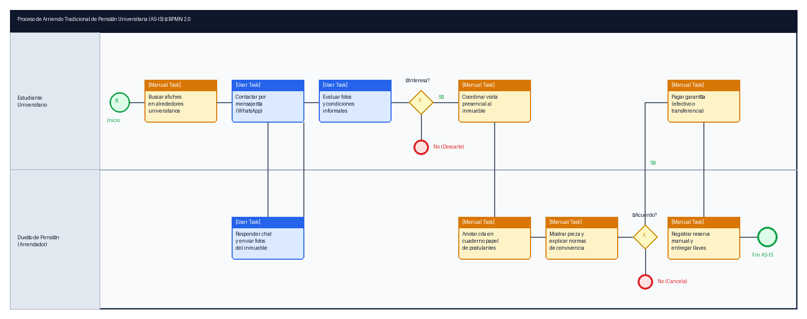
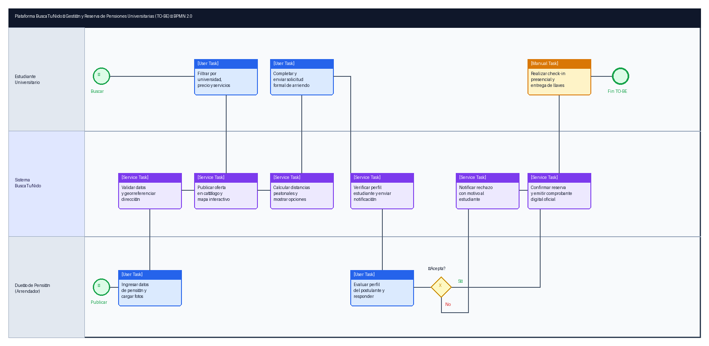

# **CIN 324 — Ingeniería de Requisitos** 

Especificación — Entrega 1 (10% del curso) 

_Documentación del proyecto en GitHub: proceso de negocio, requisitos, historias de usuario, elicitación y atributos de calidad_ 

# 1. Qué se evalúa 

Esta entrega evalúa la documentación de ingeniería de requisitos del proyecto que cada equipo ha trabajado durante el curso. Debe cubrir todos los puntos vistos hasta ahora: modelado del proceso de negocio AS-IS, análisis de rediseño con propuesta TO-BE, clasificación de requisitos, historias de usuario, técnicas de elicitación y atributos de calidad. 

El orden de los ítems de esta especificación no es arbitrario: primero se documenta el proceso (AS-IS y TO-BE), porque los requisitos y las historias de usuario que se piden a continuación deben estar asociados a las actividades que cambian entre uno y otro. La única excepción es la evidencia de elicitación, que puede haberse recogido antes de llegar al TO-BE. 

La entrega vale un 10% de la nota del curso y se evalúa con la rúbrica de la sección 5. 

# 2. Fecha de entrega 

La entrega debe estar realizada el jueves 24 de septiembre, hasta las 10:00 AM. Se verificará en clases que la entrega esté efectivamente realizada (organización, repositorio y documentos .md publicados) en ese horario. 

No se considerarán cambios realizados en el repositorio después de las 10:00 AM del jueves 24 de septiembre. 

# 3. Organización del proyecto en GitHub 

Toda la entrega se documenta dentro de una organización de GitHub del equipo, siguiendo el mismo procedimiento usado en el curso de Fundamentos de Ingeniería de Software: 

- Crear una organización de GitHub para el equipo. 

- Agregar a todos los integrantes del equipo como miembros de la organización. 

- Crear un proyecto (GitHub Projects) dentro de la organización. 

- Crear un repositorio dentro de la organización, asociado a ese proyecto. 

Toda la documentación de esta entrega vive dentro de ese repositorio, en archivos Markdown (.md). 

# 4. Estructura del repositorio y reglas de formato 

## 4.1 Documento maestro 

El repositorio debe tener, en su raíz, un documento maestro llamado exactamente IngReq-Entrega 1.md. Ese documento enlaza a todos los demás documentos .md de la entrega, en el mismo orden de la rúbrica (sección 5 y plantillas de la sección 7). 

## 4.2 Un documento por elemento 

Cada elemento de la rúbrica (sección 5) debe estar documentado en su propio archivo .md, enlazado desde el documento maestro. No se aceptan documentos que mezclen varios elementos en uno solo, ni elementos repartidos en más de un documento. 

## 4.3 Diagramas BPMN 

- Cada diagrama (AS-IS y TO-BE) se inserta en el .md correspondiente como imagen PNG, embebida con la sintaxis de Markdown:  

- Además de la imagen, debe adjuntarse en el repositorio el archivo fuente del diagrama en formato .bpmn (exportado desde Camunda Modeler y/o draw.io). 

- No se aceptan diagramas de proceso hechos en herramientas que no sean estándares de BPMN 2.0 (por ejemplo, no se acepta un diagrama de flujo genérico hecho en PowerPoint o en un editor de dibujo libre). Deben usar Camunda Modeler o bpmn.io/draw.io. 

- Tanto en el AS-IS como en el TO-BE, las tareas deben distinguir explícitamente su tipo: tarea de usuario (User Task, la ejecuta una persona con apoyo de un sistema), tarea de servicio (Service Task, la ejecuta un sistema de forma automática) y tarea manual (Manual Task, la ejecuta una persona sin apoyo de ningún sistema). No se aceptan diagramas donde todas las tareas usen el marcador genérico. 

## 4.4 Evidencia de la elicitación 

La actividad de elicitación debe incluir evidencia gráfica de con quién se realizó: una fotografía o video de la sesión en vivo, o una captura de pantalla de la conversación si se hizo en línea. Esta evidencia se adjunta o enlaza directamente en el documento de elicitación. 

# 5. Rúbrica de evaluación (grupal) 

Ocho ítems, en el mismo orden en que deben documentarse. Cada uno evaluado en los siguientes niveles: Logrado (4 puntos), Medianamente logrado (2 puntos), No logrado (1 punto), No entregado (0 puntos). Puntaje máximo: 32 puntos, escalado al 10% del curso. 

|**Ítem**|**Logrado (4)**|**Medianamente** **logrado (2)**|**No logrado (1)**|**No entregado (0)**|
|---|---|---|---|---|
|**1. Modelo AS-IS del** **proceso de negocio**|Diagrama BPMN correcto (pool, carriles, eventos, tareas, compuertas), distinguiendo tareas de usuario, de servicio y manuales, con ficha de proceso que identifica objetivos y participantes. PNG y .bpmn adjuntos.|El diagrama tiene errores de notación, no distingue los tres tipos de tarea, o falta la ficha de proceso, o falta el archivo .bpmn.|Hay un diagrama de flujo del proceso, pero no en notación BPMN reconocible.|No hay modelo del proceso AS-IS.|
|**2. Análisis de rediseño y** **propuesta TO-BE**|Iniciativas de rediseño justificadas con heurísticas del catálogo de mejores prácticas y con los objetivos de los participantes, y un diagrama TO-BE en BPMN coherente con esas iniciativas, distinguiendo tareas de usuario, de servicio y manuales. PNG y .bpmn adjuntos.|Hay propuesta TO- BE, pero las iniciativas no están justificadas, el diagrama no refleja los cambios descritos, o no distingue los tres tipos de tarea.|Se menciona una mejora general, sin iniciativas concretas ni diagrama TO-BE.|No hay análisis de rediseño ni propuesta TO-BE.|
|**3. Clasificación de** **requisitos del proyecto**|Requisitos correctamente clasificados en funcionales/no funcionales, de producto/de proyecto, con al menos un requisito derivado|La clasificación está presente pero con errores de categoría, falta el requisito derivado, o falta la asociación con la actividad que cambia.|Los requisitos están listados pero sin clasificación reconocible ni asociación con el proceso.|No hay requisitos identificados en la entrega.|

|**Ítem**|**Logrado (4)**|**Medianamente** **logrado (2)**|**No logrado (1)**|**No entregado (0)**|
|---|---|---|---|---|
||justificado, y cada requisito de producto asociado explícitamente a una actividad que cambia del AS-IS al TO-BE.||||
|**4. Historias de usuario**|Historias de usuario bien estructuradas (rol/funcionalidad/ben eficio), con criterios de aceptación claros, cada una asociada explícitamente a una actividad que cambia del AS-IS al TO-BE.|Las historias existen pero la estructura es inconsistente, faltan criterios de aceptación, o no se asocian a una actividad que cambia del AS-IS al TO-BE.|Hay una lista de funcionalidades, pero no en formato de historia de usuario ni asociada al proceso.|No hay historias de usuario.|
|**5. Documentación de** **elicitación**|Se documentan al menos dos técnicas de elicitación usadas (entrevista, grupo focal o revisión documental), con evidencia gráfica de la sesión y hallazgos claros. No es necesario que esta elicitación esté asociada al TO-BE: puede haberse realizado antes de definirlo.|Se documenta una técnica, o falta la evidencia gráfica que respalde lo levantado.|Se menciona que se elicitó información, pero sin técnica ni evidencia identificable.|No hay documentación de elicitación.|
|**6. Atributos de calidad** **priorizados**|Priorización de los 9 atributos de primer nivel de ISO 25010, con métricas definidas para los 3 más importantes|Hay priorización, pero las métricas de los atributos top 3 son vagas o incompletas.|Se mencionan atributos de calidad sin priorización ni métricas.|No hay atributos de calidad en la entrega.|
|**7. Coherencia y** **trazabilidad interna del** **documento**|. El AS-IS, el TO-BE, los requisitos y las historias de usuario son consistentes entre sí: las mismas actividades que cambian en el proceso son las que originan los requisitos y las historias documentadas|Hay inconsistencias menores entre secciones (actividades citadas en requisitos o historias que no calzan con lo que cambia en el TO-BE).|Las secciones parecen trabajadas por separado, sin relación reconocible entre ellas.|No es posible evaluar coherencia porque faltan las secciones base.|
|**8. Organización y** **repositorio GitHub**|. Organización de GitHub creada con todos los integrantes como miembros, repositorio con Project asociado, y todos los documentos .md enlazados correctamente desde IngReq-Entrega 1.md.|Falta un elemento: el Project, algún integrante no está en la organización, o algún enlace del documento maestro está roto.|Existe un repositorio, pero sin organización, sin Project o sin documentos enlazados entre sí.|No hay organización ni repositorio identificable.|

# 6. Mecanismo de calificación individual 

La nota que obtiene cada integrante en esta entrega no es directamente la nota grupal de la rúbrica: se ajusta según una evaluación de pares, anónima, que cada integrante del equipo responde sobre sus compañeros. 

**Nota Individual  =  Nota Grupal (rúbrica)  ×  Factor de Pares** 

A diferencia de otras evaluaciones del curso, aquí no hay evaluación individual por ítem de la rúbrica: toda la nota grupal se ajusta con un único Factor de Pares por integrante, calculado como se describe en el Anexo 1. 

# 7. Plantillas de los documentos .md 

Copien esta estructura para cada documento del repositorio, en el mismo orden. Reemplacen el texto entre corchetes; no dejen los corchetes en la versión final. 

## 7.1 Documento maestro — IngReq-Entrega 1.md 

<mark># Ingeniería de Requisitos — Entrega 1 ## Equipo - [Nombre integrante 1] - [Nombre integrante 2] - [Nombre integrante 3]</mark> 

<mark>## Proyecto [Nombre del proyecto y una descripción breve, 3 a 5 líneas] ## Índice de documentos 1. [Proceso AS-IS](./01-proceso-as-is.md) 2. [Rediseño y TO-BE](./02-rediseno-to-be.md) 3. [Clasif</mark> i <mark>cación de requisitos](./03-requisitos.md) 4. [Historias de usuario](./04-historias-usuario.md) 5. [Elicitación](./05-elicitacion.md) 6. [Atributos de calidad](./06-atributos-calidad.md)</mark> 

## 7.2 01-proceso-as-is.md — Proceso AS-IS 

<mark># Proceso de negocio — AS-IS ## Macro-proceso y proceso específ</mark> i <mark>co [Macro-proceso] → [Proceso específco que se modela]</mark> i <mark>## Objetivo de negocio del proceso [Descripción] ## Participantes y sus objetivos | Participante | Objetivo en el proceso | |---------------|------------------------| | [Rol 1] | [Objetivo] | | [Rol 2] | [Objetivo] | ## Diagrama AS-IS  Archivo fuente: [`./diagramas/as-is.bpmn`](./diagramas/as-is.bpmn)</mark> 

<mark>Nota: distingan tareas de usuario, de servicio y manuales con el marcador correspondiente.</mark> 

<mark>## Problemas identif</mark> i <mark>cados - [Problema 1, asociado al objetivo de un participante] - [Problema 2]</mark> 

## 7.3 02-rediseno-to-be.md — Rediseño y TO-BE 

<mark># Análisis de rediseño y propuesta TO-BE ## Mejoras identifcadas por participante</mark> i <mark>| Participante | Objetivo | Problema | Mejora deseada | |----------------|----------|----------|-----------------| | [Rol] | [Objetivo] | [Problema] | [Mejora] | ## Iniciativas de rediseño ### Iniciativa 1 - Actividad(es) del AS-IS que afecta: [tarea/actor] - Heurística aplicada: [nombre de la mejor práctica] - Objetivo o mejora que resuelve: [cuál] - Efecto esperado (tiempo/costo/calidad/fexibilidad): [descripción]</mark> l <mark>## Diagrama TO-BE  Archivo fuente: [`./diagramas/to-be.bpmn`](./diagramas/to-be.bpmn)</mark> 

<mark>Nota: distingan tareas de usuario, de servicio y manuales con el marcador correspondiente.</mark> 

<mark>## Actividades que cambian del AS-IS al TO-BE | Actividad en el AS-IS | Actividad en el TO-BE | Qué cambia | |-------------------------|--------------------------|------------| | [Actividad] | [Actividad] | [Descripción del cambio] |</mark> 

Esta tabla es la que usarán en 03-requisitos.md y 04-historias-usuario.md para asociar cada requisito e historia a la actividad que cambia. 

## 7.4 03-requisitos.md — Clasificación de requisitos 

<mark># Clasif</mark> i <mark>cación de requisitos ## Requisitos de producto | ID | Requisito | Tipo (funcional/no funcional) | Actividad TO-BE asociada | |----|-----------|--------------------------------|----------------------------|</mark> | RP-01 | [Descripción] | [Funcional / No funcional] | [Actividad del TO-BE, según la tabla de 02-rediseno-tobe.md] | <mark>## Requisitos de proyecto | ID | Requisito | |----|-----------| | RY-01 | [Descripción] | ## Requisito derivado **Requisito origen:** [ID y descripción]</mark> 

<mark>**Requisito derivado:** [Descripción] **Justif</mark> i <mark>cación:** [Por qué este requisito se deriva del anterior]</mark> 

## 7.5 04-historias-usuario.md — Historias de usuario 

<mark># Historias de usuario ## HU-01 Como [rol], quiero [funcionalidad], para [benefcio/objetivo].</mark> i <mark>**Actividad TO-BE asociada:** [actividad del TO-BE, según la tabla de 02-rediseno-to-be.md] **Criterios de aceptación:** - CA1: [descripción] - CA2: [descripción] - ... ## HU-02 Como [rol], quiero [funcionalidad], para [benefcio/objetivo].</mark> i <mark>**Actividad TO-BE asociada:** [actividad del TO-BE] **Criterios de aceptación:** - CA1: [descripción] - CA2: [descripción] - ...</mark> 

## 7.6 05-elicitacion.md — Elicitación 

<mark># Elicitación de requisitos ## Técnica 1: [entrevista / grupo focal / revisión documental] - Participante(s): [nombre o rol de quién fue elicitado] - Fecha y modalidad: [presencial / en línea] - Evidencia: [enlace o archivo de foto/video/captura de la sesión] - Hallazgos principales: [lista de lo levantado]</mark> 

<mark>## Técnica 2: [técnica] - Participante(s): [nombre o rol] - Evidencia: [enlace o archivo] - Hallazgos principales: [lista]</mark> 

<mark>## Acta de acuerdo [Resumen de lo acordado con el entrevistado o adjuntar el acta como archivo aparte]</mark> 

Nota: esta elicitación no necesita estar atada a las actividades del TO-BE; pudo haberse realizado antes de definirlo. 

## 7.7 06-atributos-calidad.md — Atributos de calidad 

<mark># Atributos de calidad (ISO 25010) ## Priorización de los 9 atributos de primer nivel 1. [Atributo más importante] 2. [Atributo] ... 9. [Atributo menos importante]</mark> 

<mark>## Métricas de los 3 atributos más importantes</mark> 

<mark>### [Atributo 1] - Métrica: [descripción de la métrica y cómo se mide] ### [Atributo 2] - Métrica: [descripción] ### [Atributo 3] - Métrica: [descripción]</mark> 

# Anexo 1: Evaluación de pares 

La evaluación de pares permite ajustar la nota grupal de manera individual, reconociendo diferencias en la contribución de cada integrante al trabajo del equipo. 

## Procedimiento 

- Cada integrante evalúa individualmente a cada uno de sus compañeros de equipo, mediante un formulario en línea, de forma anónima. 

- La evaluación se realiza aplicando la rúbrica de evaluación de pares de esta sección. 

- La Nota Final de Pares de un integrante es el promedio de las notas que recibe de sus compañeros. 

- La Nota Final de Pares determina el Factor de Pares, que se aplica sobre la Nota Grupal según la fórmula de la sección 6. 

## Rúbrica de evaluación de pares (formulario) 

Cuatro ítems, cada uno evaluado en tres niveles. Puntaje máximo: 20 puntos. 

|**Ítem**|**Logrado (5 pts)**|**Medianamente logrado (3** **pts)**|**No logrado (0 pts)**|
|---|---|---|---|
|**Compromiso**|Siempre cumple con las responsabilidades en el tiempo comprometido y con calidad aceptable. Asiste a todas las reuniones o avisa con justificación.|Algunas veces cumple. Asiste a la mayoría de las reuniones.|No muestra interés ni compromiso. No asiste a las reuniones.|
|**Proactividad**|Siempre se anticipa a los requerimientos, llega preparado y se adelanta a tomar responsabilidades.|Algunas veces se anticipa y llega preparado.|Pregunta qué tiene que hacer y evade responsabilidades.|
|**Calidad**|Entrega trabajo de calidad aceptable que no necesita grandes correcciones para integrarse.|La calidad es buena pero necesita correcciones para quedar al nivel del equipo.|La calidad es mala. Su parte debe rehacerse o corregirse significativamente.|
|**Coordinación**|Siempre se mantiene en contacto con el equipo. Es fácil encontrarlo o inicia la coordinación.|La mayoría de las veces se mantiene en contacto y es relativamente fácil de ubicar.|Es muy difícil comunicarse. En ocasiones no asiste porque fue imposible contactarlo.|

## Conversión de puntaje a Nota de Pares 

|**0**|**1**|**2**|**3**|**4**|**5**|**6**|
|---|---|---|---|---|---|---|
|1,0|1,3|1,5|1,8|2,0|2,3|2,5|
|**7**|**8**|**9**|**10**|**11**|**12**|**13**|
|2,8|3,0|3,3|3,5|3,8|4,0|4,4|
|**14**|**15**|**16**|**17**|**18**|**19**|**20**|
|4,8|5,1|5,5|5,9|6,3|6,6|7,0|

## Factor de Pares 

|**Nota Final de Pares**|**Factor de Pares**|
|---|---|
|1,0–1,9|**20%**|
|2,0– 2,9|**30%**|
|3,0–3,9|**50%**|
|4,0– 4,9|**60%**|
|5,0–5,9|**75%**|
|6,0–6,9|**100%**|
|7,0|**105%**|

_Ejemplo: Nota Grupal = 5,5 | Nota Final de Pares = 6,2 → Factor de Pares = 100% → Nota Individual = 5,5._ 

